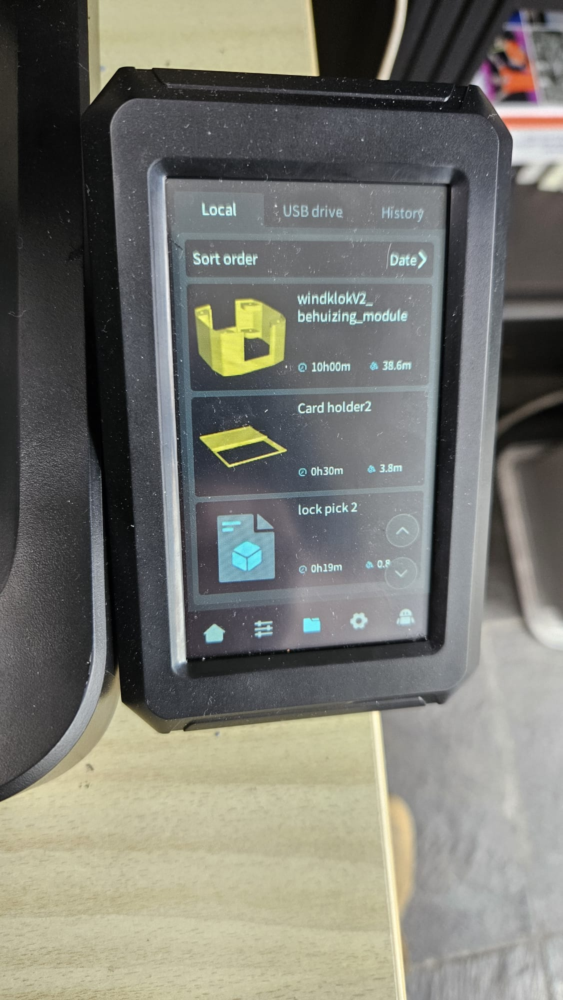
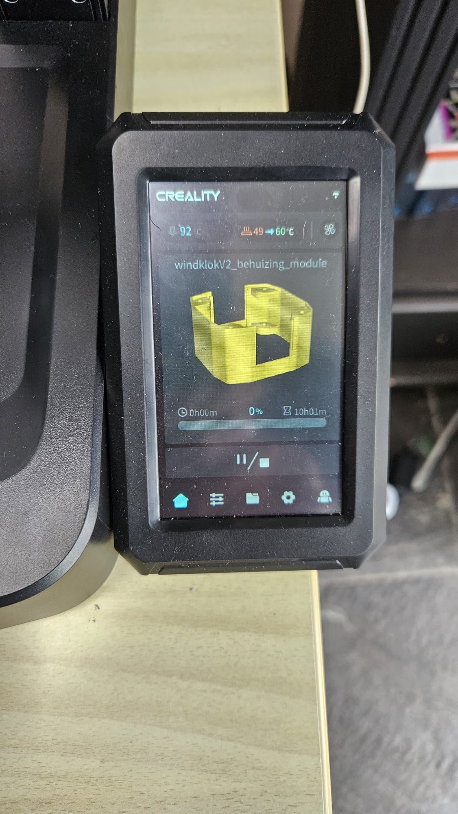

# Cura Thumbnail Generator For Creality
Post processing script.
Automatically adds two thumbnails to the G-code file via Cura.
Tested with Ultimaker Cura 5.9 and Creality Ender 3 V3 KE.

# What this solves:
Cura does not generate thumbnails, and post-processing scripts from the open-source community either generate only one thumbnail or a non-working one.
This issue occurs because the Creality firmware deviates in how it interprets thumbnails compared to the agreed-upon standard.
Bug or necessary feature? Either way, this script fixes it.

When you install this script, Cura will automatically add both large and small thumbnails to the G-code file, ensuring that your model appears on the printer’s display exactly as it does in Cura.

    

# Script installeren in Cura:
## 1 Download the script:
Download the script code from this repository and save it locally as:
[Ender3V3KEAutoThumbnail.py](Ender3V3KEAutoThumbnail.py)
Proceed to place the script in the correct folder in step 2.

## 2 Install the script
Open Cura and go to:
```Help```> ```Show Configuration Folder```  
Open the scripts folder, which is usually located at:
```C:\Users\<JouwNaam>\AppData\Roaming\cura\<Cura-versie>\scripts``` (Windows)  
```~/.local/share/cura/<Cura-versie>/scripts``` (Linux/Mac)  
Copy the file [Ender3V3KEAutoThumbnail.py](Ender3V3KEAutoThumbnail.py) into this folder.

## 3 Use in Cura
To activate this script as a post-processing script, you need to add it manually.

Restart Cura so the script is loaded.
Go to: ```Extensions``` > ```Post Processing``` > ```Modify G-code```  
Select ```Ender 3 Auto Thumbnail``` from the list.
Click ```Add Script```      
And done. Click ```Close```

Since the script is now activated, you will see an indicator in the bottom-right corner of Cura with </> and at least a 1 next to it. This means a post-processing script is active.
Thumbnail generation in .gcode files now happens automatically.

### License
This project is licensed under the MIT License - see the [LICENSE](LICENSE) file for details.
